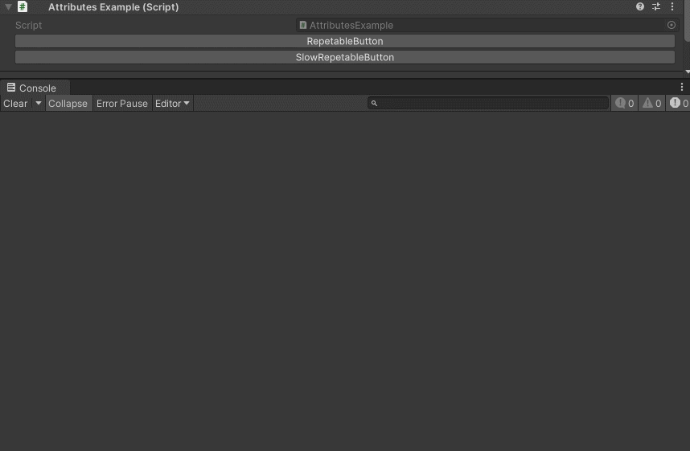
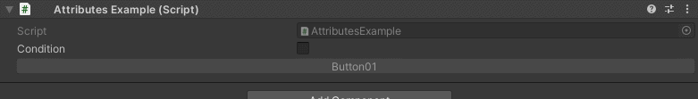
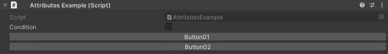

Button Attribute
================

Attribute to add a button in the inspector.

**Parameters:**
	- ``bool`` isRepetable: Makes the button repeat logic on hold
	- ``string`` conditionName: The name of the condition to evaluate
	- ``object`` enumValue: The value of the enum condition
	- ``ConditionResult`` conditionResult: What happens to the button when the condition evaluates to true
	- `optional`, ``bool`` negate: Negate the evaluated condition
	- `optional`, ``long`` pressDelay: How many milliseconds to wait before the logic is executed on hold
	- `optional`, ``long`` repetitionInterval: The interval in milliseconds the logic will repeat
	- `optional`, ``string`` buttonLabel: The label displayed on the button
	- `optional`, ``float`` buttonHeight: The height of the button in pixels
	- `optional`, ``bool`` serializeParameters: Have the button parameters persist between selections

Example::

	using UnityEngine;
	using EditorAttributes;
	
	public class AttributesExample : MonoBehaviour
	{
		[Button]
		public void Button() => print("Hello World!");
	
		[Button("Button", 30f)]
		public void TallButton() => print("Im Tall!");
	}

.. image:: ../../Images/Button01.png

If your function has parameters they will be displayed under the button as a foldout::

	using UnityEngine;
	using EditorAttributes;
	
	public class AttributesExample : MonoBehaviour
	{
		[Button]
		public void ButtonParams(int param01) => print(param01);
	}

.. image:: ../../Images/Button02.png

.. note::
	Collections, UnityEvents, GameObject, serialized objects and ``out`` or ``ref`` parameters are not supported

Due to how buttons are drawn, parameters are serialized trough a custom system into JSON files, those JSON files are saved in ``YourProjectRoot\ProjectSettings\EditorAttributes``, to not 
have the parameters save you can set the `serializeParameters` parameter to ``false``, this is reccomended to avoid unneccesary clutter when you have tons of objects in your scene that do not need
the parameters to be saved. You can also delete all serialized parameters from the :doc:`../../GettingStarted/editorattributessettings`.

You can make a button to keep executing on hold by marking it as repetable::

	using UnityEngine;
	using EditorAttributes;
	
	public class AttributesExample : MonoBehaviour
	{
		[Button(true)]
		public void RepetableButton() => print(Random.value);
	
		[Button(true, pressDelay: 200, repetitionInterval: 500)]
		public void SlowRepetableButton() => print(Random.value);
	}

You can also enable/disable or show/hide buttons based on a given condition::

	using UnityEngine;
	using EditorAttributes;
	
	public class AttributesExample : MonoBehaviour
	{
		[SerializeField] private bool condition;
	
		[Button(nameof(condition), ConditionResult.EnableDisable)]
		public void Button01() => print("Hello World!");
	
		[Button(nameof(condition), ConditionResult.ShowHide)]
		public void Button02() => print("Hello World!");
	}

Now the buttons will be disabled/hidden by default until the `condition` is true

If you wish for the button to be enabled/shown by default and disabled/hidden when the `conditon` is true, you can set the `negate` parameter to true::

	using UnityEngine;
	using EditorAttributes;
	
	public class AttributesExample : MonoBehaviour
	{
		[SerializeField] private bool condition;
	
		[Button(nameof(condition), ConditionResult.EnableDisable, true)]
		public void Button01() => print("Hello World!");
	
		[Button(nameof(condition), ConditionResult.ShowHide, true)]
		public void Button02() => print("Hello World!");
	}

You can also use an ``enum`` as a condition the same way you would use it with :doc:`../ConditionalAttributes`.

.. note::
	The attribute won't work inside a serialized ``struct`` or ``class``