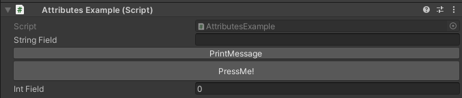
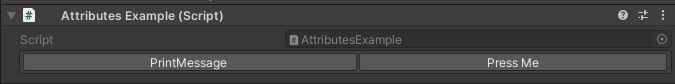

ButtonField Attribute
=====================

Attribute to add a button in the inspector in place of a field.

**Parameters:**
	- ``string`` functionName: The name of the function to call
	- `optional`, ``string`` buttonLabel: The label displayed on the button
	- `optional`, ``float`` buttonHeight: The height of the button in pixels

Buttons made using the :doc:`button` will always be drawn after all the fields, use the `ButtonField Attribute` instead if you want to add buttons anywhere in the inspector::

	using UnityEngine;
	using EditorAttributes;
	
	public class AttributesExample : MonoBehaviour
	{
		[SerializeField] private string stringField;

		[ButtonField(nameof(PrintMessage))]
		[SerializeField] private Void buttonHolder;
	
		[ButtonField(nameof(PrintMessage), "PressMe!", 30f)]
		[SerializeField] private Void tallButtonHolder;
	
		[SerializeField] private int intField;
	
		private void PrintMessage() => print("Hello World!");
	}

By using the `ButtonField Attribute` you can also add buttons inside groups::

	using UnityEngine;
	using EditorAttributes;
	
	public class AttributesExample : MonoBehaviour
	{
		[HorizontalGroup(true, nameof(buttonHolder01), nameof(buttonHolder02))]
		[SerializeField] private Void groupHolder;
		
		[ButtonField(nameof(PrintMessage))]
		[SerializeField, HideInInspector] private Void buttonHolder01;
		
		[ButtonField(nameof(PrintMessage), "Press Me")]
		[SerializeField, HideInInspector] private Void buttonHolder02;
	
		private void PrintMessage() => print("Hello World!");
	}

.. note::
	The `ButtonField Attribute` does not support functions with parameters.
