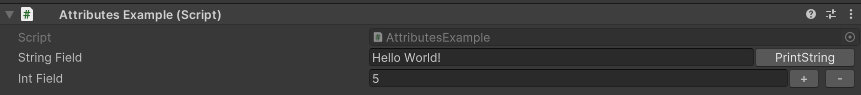

InlineButton Attribute
======================

Attribute to add a button next to a property.

**Parameters:**
	- ``string`` functionName: The name of the function the button activates
	- `optional`, ``string`` buttonLabel: The label displayed on the button
	- `optional`, ``float`` buttonWidth: The width of the button in pixels

Example::

	using UnityEngine;
	using EditorAttributes;
	
	public class AttributesExample : MonoBehaviour
	{
		[SerializeField, InlineButton(nameof(InlineButton))] private int intField;
		[SerializeField, InlineButton(nameof(PrintString), "Press Me!", 200f)] private string stringField;
		
		private void InlineButton() => print("Hello World!");
		
		private void PrintString() => print(stringField);
	}

.. note::
	The attribute won't work well inside data tables