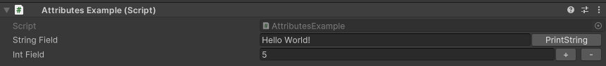
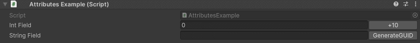

InlineButton Attribute
======================

Attribute to add a button next to a property.

**Parameters:**
	- ``string`` functionName: The name of the function the button activates
	- ``bool`` isRepetable: Makes the button repeat logic on hold
	- `optional`, ``long`` pressDelay: How many milliseconds to wait before the logic is executed on hold
	- `optional`, ``long`` repetitionInterval: The interval in milliseconds the logic will repeat
	- `optional`, ``string`` buttonLabel: The label displayed on the button
	- `optional`, ``float`` buttonWidth: The width of the button in pixels

Example::

	using UnityEngine;
	using EditorAttributes;
	
	public class AttributesExample : MonoBehaviour
	{
		[InlineButton(nameof(PrintString))]
		[SerializeField] private string stringField;
	
		[InlineButton(nameof(IncreaseValue), "+", 30f), InlineButton(nameof(DecreaseValue), "-", 30f)]
		[SerializeField] private int intField;
	
		private void IncreaseValue() => intField++;
		private void DecreaseValue() => intField--;
	
		private void PrintString() => print(stringField);
	}

You can make a button to keep executing on hold by marking it as repetable::

	using System;
	using UnityEngine;
	using EditorAttributes;
	
	public class AttributesExample : MonoBehaviour
	{
		[InlineButton(nameof(Add10), true, buttonLabel: "+10")]
		[SerializeField] private int intField;
	
		[InlineButton(nameof(GenerateGUID), true, 100, 500)]
		[SerializeField] private string stringField;
	
		public void Add10() => intField += 10;
		public void GenerateGUID() => stringField = Guid.NewGuid().ToString();
	}

.. note::
	The attribute won't work well inside data tables