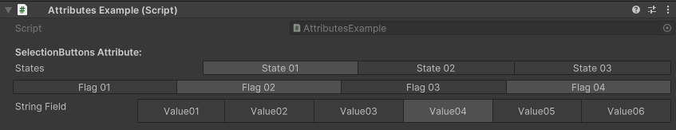

SelectionButtons Attribute
==========================

.. warning::
	This attribute has been deprecated in **Unity 6** and above, use the *EnumButtons Attribute* instead

Attribute to display a bunch of values in toggleble buttons.

**Parameters:**
	- `optional`, ``string`` collectionName: The name of the collection
	- `optional`, ``float`` buttonsHeight: The height of the selection buttons in pixels
	- `optional`, ``bool`` showLabel: Show the label of the field

Example::

	using System;
	using UnityEngine;
	using EditorAttributes;
	
	public class AttributesExample : MonoBehaviour
	{
		public enum States
		{
			State01,
			State02,
			State03
		}
	
		[Flags]
		public enum Flags
		{
			Nothing = 0,
			Flag01 = 1,
			Flag02 = 2,
			Flag03 = 4,
			Flag04 = 8
		}
	
		[Header("SelectionButtons Attribute:")]
		[SerializeField, SelectionButtons] private States states;
		[SerializeField, SelectionButtons(showLabel: false)] private Flags flags;
		[SerializeField, SelectionButtons(nameof(stringValues), buttonsHeight: 30f)] private string stringField;
	
		private string[] stringValues = new string[]
		{
			"Value01", "Value02", "Value03", "Value04", "Value05", "Value06"
		};
	}

