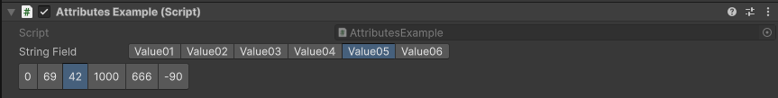
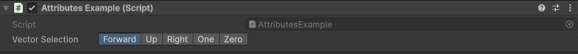

ValueButtons Attribute
======================

Attribute to display a collection of values in toggleble buttons.

**Parameters:**
	- ``string`` collectionName: The name of the collection
	- ``string[]`` displayNames: Change the display name for each button
	- `optional`, ``float`` buttonsHeight: The height of the selection buttons in pixels
	- `optional`, ``bool`` showLabel: Show the label of the field

Example::

	using UnityEngine;
	using EditorAttributes;
	
	public class AttributesExample : MonoBehaviour
	{	
		[SerializeField, ValueButtons(nameof(stringValues))] private string stringField;
		[SerializeField, ValueButtons(nameof(intValues), 30f, false)] private int intField;
	
		private string[] stringValues = new string[]
		{
			"Value01", "Value02", "Value03", "Value04", "Value05", "Value06"
		};
		
		private int[] intValues = new int[]
		{
			0, 69, 42, 1000, 666, -90
		};
	}

You can also customize how to display button values by passing a ``string`` array like this::

	using UnityEngine;
	using EditorAttributes;
	
	public class AttributesExample : MonoBehaviour
	{
		[ValueButtons(nameof(buttonValues), new string[] { "Forward", "Up", "Right", "One", "Zero" })]
		[SerializeField] private Vector3 vectorSelection;

		private Vector3[] buttonValues = new Vector3[]
		{
			Vector3.forward, Vector3.up, Vector3.right, Vector3.one, Vector3.zero
		};
	}

Or alternatively use a Dictionary where the keys will be used for display::

	using UnityEngine;
	using EditorAttributes;
	using System.Collections.Generic;
	
	public class AttributesExample : MonoBehaviour
	{
		[ValueButtons(nameof(buttonValues))]
		[SerializeField] private Vector3 vectorSelection;

		private Dictionary<string, Vector3> buttonValues = new()
		{
			{ "Forward", Vector3.forward },
			{ "Up", Vector3.up },
			{ "Right", Vector3.right },
			{ "One", Vector3.one },
			{ "Zero", Vector3.zero }
		};
	}
	

.. note:: 
	If you try to use both a Dictionary and a ``string`` array with the attribute, the array will take priority for the displayed values.
