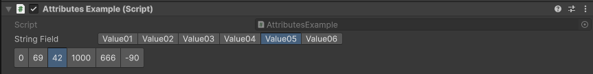

ValueButtons Attribute
======================

.. note::
	This attribute is only available in *Unity 6 and above*, use the :doc:`selectionbuttons` for the same functionality

Attribute to display a collection of values in toggleble buttons.

**Parameters:**
	- ``string`` collectionName: The name of the collection
	- `optional`, ``float`` buttonsHeight: The height of the selection buttons in pixels
	- `optional`, ``bool`` showLabel: Show the label of the field

Example::

	using UnityEngine;
	using EditorAttributes;
	
	public class AttributesExample : MonoBehaviour
	{	
		[SerializeField, ValueButtons(nameof(stringValues))] private string stringField;
		[SerializeField, ValueButtons(nameof(intValues), 30f, false)] private int intField;
	
		private string[] stringValues = new string[]
		{
			"Value01", "Value02", "Value03", "Value04", "Value05", "Value06"
		};
		
		private int[] intValues = new int[]
		{
			0, 69, 42, 1000, 666, -90
		};
	}

