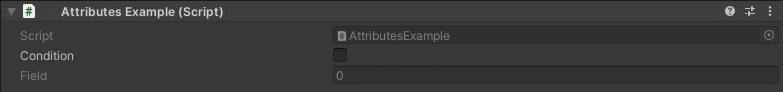
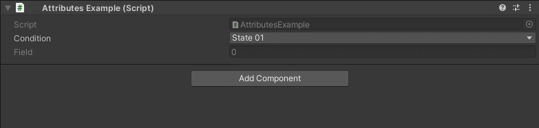

EnableField Attribute
=====================

Attribute to enable a field based on a condition.

**Parameters:**
	- ``string`` conditionName: The name of the condition to evaluate
	- ``object`` enumValue: The value of the enum condition
	
The field will remain disabled by default until its condition becomes true::

	using UnityEngine;
	using EditorAttributes;
	
	public class AttributesExample : MonoBehaviour
	{
		[SerializeField] private bool condition;
	
		[SerializeField, EnableField(nameof(condition))] private int field;
	}
	

You can also use enums as a condition like this::

	using UnityEngine;
	using EditorAttributes;
	
	public class AttributesExample : MonoBehaviour
	{
		private enum States
		{
			State01,
			State02,
			State03
		}
	
		[SerializeField] private States condition;
	
		[SerializeField, EnableField(nameof(condition), States.State02)] private int field;
	}
	
The field will be enabled when the ``enum`` is set to `State02`.

