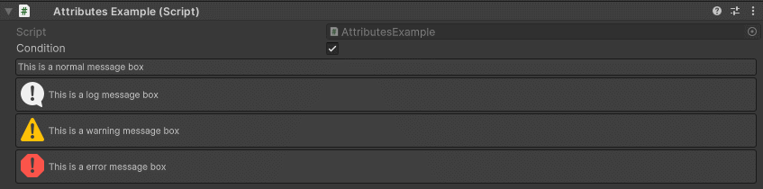
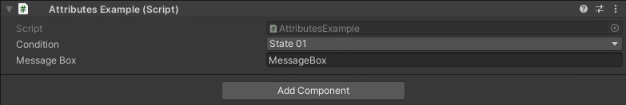
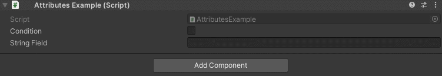

MessageBox Attribute
====================

Attribute to display a message box depending on a condition.

**Parameters:**
	- ``string`` message: The message to display
	- ``string`` conditionName: The condition to evaluate
	- ``object`` enumValue: The value of the enum
	- `optional`, ``MessageMode`` messageType: The type of the message
	- `optional`, ``StringInputMode`` stringInputMode: Set if the string input is set trough a constant or dynamically trough another member
	- `optional`, ``bool`` drawAbove: Draws the HelpBox above the attached field

Example::

	using UnityEngine;
	using EditorAttributes;
	
	public class AttributesExample : MonoBehaviour
	{
		[SerializeField] private bool condition;

		[SerializeField, MessageBox("This is a normal message box", nameof(condition), MessageMode.None)]
		private Void messageBox;

		[SerializeField, MessageBox("This is a log message box", nameof(condition), MessageMode.Log)]
		private Void messageBoxLog;

		[SerializeField, MessageBox("This is a warning message box", nameof(condition), MessageMode.Warning)]
		private Void messageBoxWarning;

		[SerializeField, MessageBox("This is a error message box", nameof(condition), MessageMode.Error)]
		private Void messageBoxError;
	}

The message boxes will show only when the condition is true.

You can also use an ``enum`` as a condition like so::

	using UnityEngine;
	using EditorAttributes;
	
	public class AttributesExample : MonoBehaviour
	{
		public enum States
		{
			State01,
			State02,
			State03
		}
	
		[SerializeField] private States condition;
	
		[SerializeField, MessageBox("This is a message box", nameof(condition), States.State02)]
		private string messageBox;
	}

The message boxes will show when the ``enum`` is set to `State02`.

You can dynamically change the message by setting the `stringInputMode` parameter to dynamic and specify a member name in the string parameter to get the string value from::

	using UnityEngine;
	using EditorAttributes;
	
	public class AttributesExample : MonoBehaviour
	{
		[SerializeField] private bool condition;
	
		[MessageBox(nameof(stringField), nameof(condition), stringInputMode: StringInputMode.Dynamic)]
		[SerializeField] private string stringField;
	}
	

MessageBoxes have rich text support.
