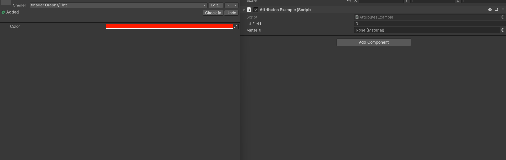

ApplyMaterial Attribute
=======================

.. note::
	This attribute is only available in *Unity 6.3 and above*.

Attribute to apply a custom UI Toolkit material on a property

**Parameters:**
	- ``string`` materialMemberName: The name of the member that returns the UI Toolkit material

Example::

	using UnityEngine;
	using EditorAttributes;
	
	public class AttributesExample : MonoBehaviour
	{
		[SerializeField, ApplyMaterial(nameof(material))] private int intField;
		[SerializeField] private Material material;
	}

In this example I created a simple tint shader to assign to the material field.

.. image:: ../../Media/ApplyMaterial01.png

If I assign the, the field will be rendered with my custom material.
I can change the color property of my material and the field will update accordingly.

