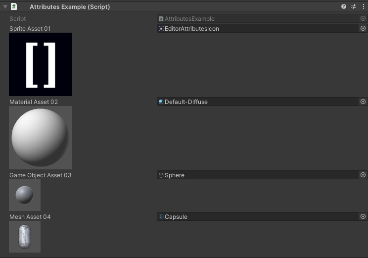

AssetPreview Attribute
======================

Attribute to preview an asset in the inspector

**Parameters:**
	- `optional`, ``float`` previewWidth: The width of the preview in pixels
	- `optional`, ``float`` previewHeight: The height of the preview in pixels

Example::

	using UnityEngine;
	using EditorAttributes;
	
	public class AttributesExample : MonoBehaviour
	{
		[SerializeField, AssetPreview] private Sprite spriteAsset01;
		[SerializeField, AssetPreview] private Material materialAsset02;
		[SerializeField, AssetPreview(64f, 64f)] private GameObject gameObjectAsset03;
		[SerializeField, AssetPreview(64f, 64f)] private Mesh meshAsset04;
	}
	

