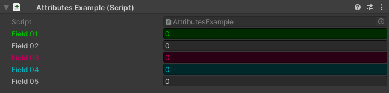

ColorField Attribute
====================

.. warning::
	This attribute has been deprecated, use :doc:`guicolor` instead
	
.. note::
	Because UI toolkit makes tinting elements very difficult, it's not possible to properly tint properties with ColorField, 
	this attribute will stay deprecated until Unity adds an easyer way of tinting elements.
	Which I estimate it will be in about 234287346598175492164 years.
	If you think this attribute would work well enough for you, feel free to uncomment all the code in ColorFieldDrawer.cs

Attribute to color a field in the inspector

**Parameters:**
	- ``float`` red: Red amount
	- ``float`` green: Green amount
	- ``float`` blue: Blue amount
	- ``string`` hexColor: The color in hexadecimal
	- ``GUIColor`` color: The color of the field

Unlike the :doc:`guicolor` the `ColorField Attribute` only colors the field is attached to and overrides the :doc:`guicolor`::

	using UnityEngine;
	using EditorAttributes;
	
	public class AttributesExample : MonoBehaviour
	{
		[SerializeField, ColorField(GUIColor.Green)] private int field01;
		[SerializeField] private int field02;
		[SerializeField, ColorField(255f, 0f, 123f)] private int field03;
		[SerializeField, ColorField("#00f2ff")] private int field04;
		[SerializeField] private int field05;
	}
	

