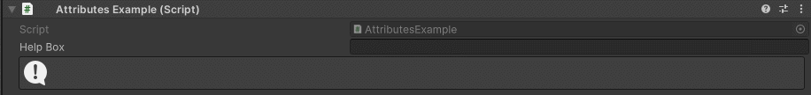

HelpBox Attribute
=================

Attribute to display a help box.

**Parameters:**
	- ``string`` message: The message to display
	- `optional`, ``MessageMode`` messageType: The type of the message
	- `optional`, ``StringInputMode`` stringInputMode: Set if the string input is set trough a constant or dynamically trough another member
	- `optional`, ``bool`` drawAbove: Draws the HelpBox above the attached field
	
Example::

	using UnityEngine;
	using EditorAttributes;
	
	public class AttributesExample : MonoBehaviour
	{
		[SerializeField, HelpBox("This is a normal help box", MessageMode.None)] 
		private string helpBox;
	
		[SerializeField, HelpBox("This is a log help box", MessageMode.Log)]
		private string helpBoxLog;
	
		[SerializeField, HelpBox("This is a warning help box", MessageMode.Warning)]
		private string helpBoxWarning;
	
		[SerializeField, HelpBox("This is a error help box", MessageMode.Error)]
		private string helpBoxError;
	}
	
.. image:: ../../Images/HelpBox01.png

You can dynamically change the text by setting the stringInputMode parameter to dynamic and specify a member name in the string parameter to get the string value from::

	using UnityEngine;
	using EditorAttributes;
	
	public class AttributesExample : MonoBehaviour
	{
		[HelpBox(nameof(helpBox), MessageMode.Log, StringInputMode.Dynamic)]
		[SerializeField] private string helpBox;
	}

Help boxes have rich text support.
