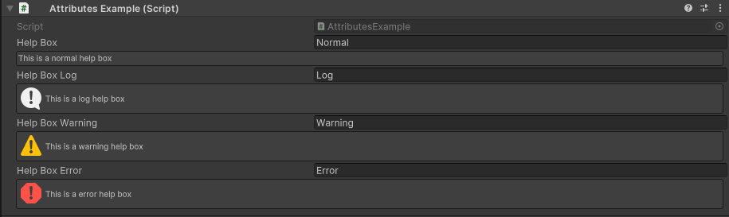

HelpBox Attribute
=================

Attribute to display a help box.

**Parameters:**
	- ``string`` message: The message to display
	- `optional`, ``MessageMode`` messageType: The type of the message
	
Example::

	using UnityEngine;
	using EditorAttributes;
	
	public class AttributesExample : MonoBehaviour
	{
		[SerializeField, HelpBox("This is a normal help box", MessageMode.None)] 
		private string helpBox;
	
		[SerializeField, HelpBox("This is a log help box", MessageMode.Log)]
		private string helpBoxLog;
	
		[SerializeField, HelpBox("This is a warning help box", MessageMode.Warning)]
		private string helpBoxWarning;
	
		[SerializeField, HelpBox("This is a error help box", MessageMode.Error)]
		private string helpBoxError;
	}
	

