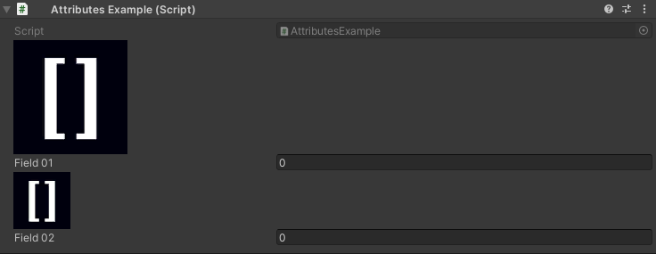
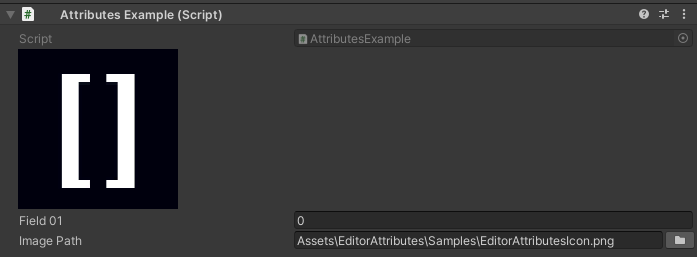

Image Attribute
===============

Attribute to draw an image in the inspector

**Parameters:**
	- ``string`` imagePath: The path of the image asset
	- `optional`, ``float`` imageWidth: The width of the image in pixels
	- `optional`, ``float`` imageHeight: The height of the image in pixels
	- `optional`, ``StringInputMode`` stringInputMode: Set if the string input is set trough a constant or dynamically trough another member

If there is no size given it will default to the image size::

	using UnityEngine;
	using EditorAttributes;
	
	public class AttributesExample : MonoBehaviour
	{
		[Image("Assets/Image.png")]
		[SerializeField] private int field01;

		[Image("Assets/Image.png", 64f, 64f)]
		[SerializeField] private int field02;
	}

You can dynamically change the image by setting the `stringInputMode` parameter to dynamic and specify a member name in the string parameter to get the image path from::

	using UnityEngine;
	using EditorAttributes;
	
	public class AttributesExample : MonoBehaviour
	{
		[Image(nameof(imagePath), stringInputMode: StringInputMode.Dynamic)]
		[SerializeField] private int field01;
	
		[SerializeField, FilePath(filters: "png")] private string imagePath;
	}

