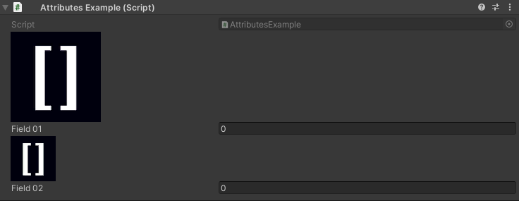

Image Attribute
===============

Attribute to draw an image in the inspector

**Parameters:**
	- ``string`` imagePath: The path of the image asset
	- `optional`, ``float`` imageWidth: The width of the image
	- `optional`, ``float`` imageHeight: The height of the image

If there is no size given it will default to the image size::

	using UnityEngine;
	using EditorAttributes;
	
	public class AttributesExample : MonoBehaviour
	{
		[Image("Assets/Image.png")]
		[SerializeField] private int field01;

		[Image("Assets/Image.png", 64f, 64f)]
		[SerializeField] private int field02;
	}

