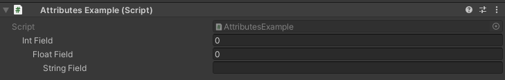

IndentProperty Attribute
========================

Attrtibute to indent a property in the inspector

**Parameters:**
	- `optional`, ``int`` indentLevel: The amount to indent by

Example::

	using UnityEngine;
	using EditorAttributes;
	
	public class AttributesExample : MonoBehaviour
	{
		[SerializeField, IndentProperty] private int intField;
		[SerializeField, IndentProperty(2)] private float floatField;
		[SerializeField, IndentProperty(3)] private string stringField;
	}
	

