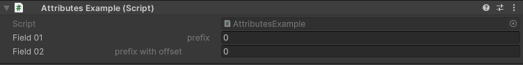

Prefix Attribute
================

Attribute to add a prefix on a field

**Parameters:**
	- ``string`` prefix: The prefix to add
	- `optional`, ``float`` offset: Offset to add between the prefix and field

Example::

	using UnityEngine;
	using EditorAttributes;
	
	public class AttributesExample : MonoBehaviour
	{
		[SerializeField, Prefix("prefix")] private int field01;
		[SerializeField, Prefix("prefix with offset", 20f)] private int field02;
	}

