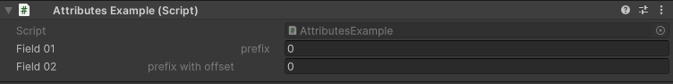
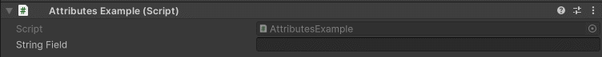

Prefix Attribute
================

Attribute to add a prefix on a field

**Parameters:**
	- ``string`` prefix: The prefix to add
	- `optional`, ``float`` offset: Offset to add between the prefix and field in pixels
	- `optional`, ``StringInputMode`` stringInputMode: Set if the string input is set trough a constant or dynamically trough another member

Example::

	using UnityEngine;
	using EditorAttributes;
	
	public class AttributesExample : MonoBehaviour
	{
		[SerializeField, Prefix("prefix")] private int field01;
		[SerializeField, Prefix("prefix with offset", 50f)] private int field02;
	}

You can dynamically change the label by setting the `stringInputMode` parameter to dynamic and specify a member name in the string parameter to get the string value from::

	using UnityEngine;
	using EditorAttributes;
	
	public class AttributesExample : MonoBehaviour
	{
		[Prefix(nameof(stringField), stringInputMode: StringInputMode.Dynamic)]
		[SerializeField] private string stringField;
	}
	

