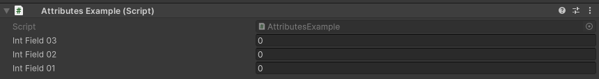

PropertyOrder Attribute
=======================

Attribute to change the drawing order of a field

**Parameters:**
	- ``int`` order: The number to other the field by

The default order of all properties is 0 if you want to order fields before fields without the attribute use negative numbers::

	using UnityEngine;
	using EditorAttributes;
	
	public class AttributesExample : MonoBehaviour
	{
		[SerializeField, PropertyOrder(3)] private int intField01;
		[SerializeField, PropertyOrder(2)] private int intField02;
		[SerializeField, PropertyOrder(1)] private int intField03;
	}
	

.. note::
	You cannot reorder nested properties.
