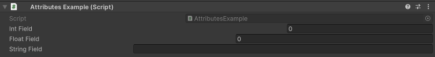

PropertyWidth Attribute
=======================

Attribute to adjust the width of a property's label and field

**Parameters:**
	- ``float`` labelWidth: The width of the label
	- `optional`, ``float`` labelWidth: The minimum width reserved for the fields

Example::

	using UnityEngine;
	using EditorAttributes;
	
	public class AttributesExample : MonoBehaviour
	{
		[SerializeField, PropertyWidth(300f)] private int intField;
		[SerializeField, PropertyWidth(200f)] private float floatField;
		[SerializeField, PropertyWidth(100f)] private string stringField;
	}
	

