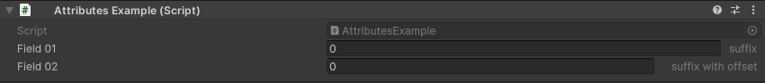

Suffix Attribute
================

Attribute to add a suffix on a field

**Parameters:**
	- ``string`` suffix: The suffix to add
	- `optional`, ``float`` offset: Offset to add between the suffix and field

Example::

	using UnityEngine;
	using EditorAttributes;
	
	public class AttributesExample : MonoBehaviour
	{
		[SerializeField, Suffix("suffix")] private int field01;
		[SerializeField, Suffix("suffix with offset", 20f)] private int field02;
	}

