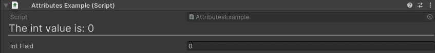

Title Attribute
===============

Attribute to draw a fully customizable header

**Parameters:**
	- ``string`` title: The text of the title
	- `optional`, ``int`` titleSize: The size of the title font
	- `optional`, ``bool`` drawLine: Draw a line under the title
	- `optional`, ``float`` lineThickness: The thickness of the line in pixels
	- `optional`, ``float`` titleSpace: The space between the title and field
	- `optional`, ``TextAnchor`` alignment: The alignment of the title
	- `optional`, ``StringInputMode`` stringInputMode: Set if the string input is set trough a constant or dynamically trough another member

You can further customize titles with rich text support::

	using UnityEngine;
	using EditorAttributes;
	
	public class AttributesExample : MonoBehaviour
	{
		[Title("This is a title!")]
		[SerializeField] private int intField01;
		[SerializeField] private string stringField01;
		[SerializeField] private float floatField01;
	
		[Title("<b>Big bold title!</b>", 40, lineThickness: 10f, alignment: TextAnchor.MiddleRight)]
		[SerializeField] private int intField02;
		[SerializeField] private string stringField02;
		[SerializeField] private float floatField02;
	
		[Title("<i>This is an italic title with no line!</i>", 30, 20f, false, alignment: TextAnchor.MiddleCenter)]
		[SerializeField] private int intField03;
		[SerializeField] private string stringField03;
		[SerializeField] private float floatField03;
	}

.. image:: ../../Images/Title01.png

You can dynamically change the title by settings the `stringInputMode` parameter to dynamic and specify a member name in the string parameter to get the string value from::

	using UnityEngine;
	using EditorAttributes;
	
	public class AttributesExample : MonoBehaviour
	{
		[Title(nameof(DynamicTitle), stringInputMode: StringInputMode.Dynamic)]
		[SerializeField] private int intField;
	
		public string DynamicTitle => $"The int value is: {intField}";
	}

