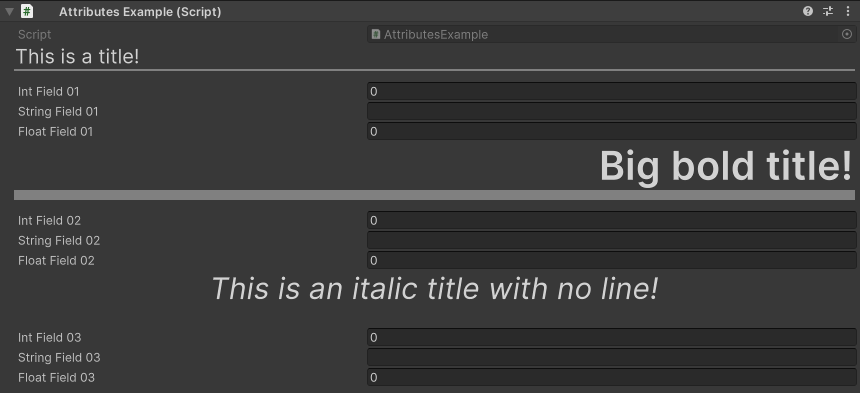

Title Attribute
===============

Attribute to draw a fully customizable header

**Parameters:**
	- ``string`` title: The text of the title
	- `optional`, ``int`` titleSize: The size of the title
	- `optional`, ``bool`` drawLine: Draw a line under the title
	- `optional`, ``TextAnchor`` alignment: The alignment of the title

Example::

	using UnityEngine;
	using EditorAttributes;
	
	public class AttributesExample : MonoBehaviour
	{
		[Title("This is a title!")]
		[SerializeField] private int intField01;
		[SerializeField] private string stringField01;
		[SerializeField] private float floatField01;
	
		[Title("<b>Big bold title!</b>", 40, alignment: TextAnchor.MiddleRight)]
		[SerializeField] private int intField02;
		[SerializeField] private string stringField02;
		[SerializeField] private float floatField02;
	
		[Title("<i>This is an italic title with no line!</i>", 30, false, TextAnchor.MiddleCenter)]
		[SerializeField] private int intField03;
		[SerializeField] private string stringField03;
		[SerializeField] private float floatField03;
	}

