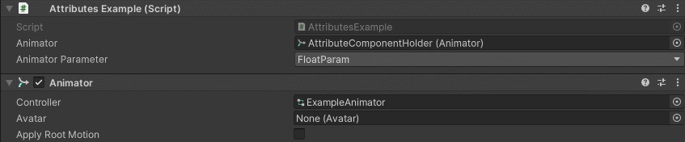

AnimatorParamDropdown Attribute
===============================

Attribute to display a dropdown of animator parameters

**Parameters:**
	- ``string`` animatorFieldName: The animator from which to get the parameters

.. note::
	The `AnimatorParamDropdown Attribute` can only be attached to a ``string``

Example::

	using UnityEngine;
	using EditorAttributes;
	
	public class AttributesExample : MonoBehaviour
	{
		[SerializeField] private Animator animator;

		[SerializeField, AnimatorParamDropdown(nameof(animator))] private string animatorParameter;
	}

