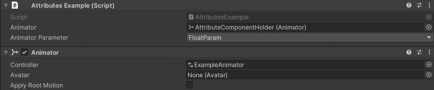

AnimatorParamDropdown Attribute
===============================

Attribute to display a dropdown of animator parameters

**Parameters:**
	- ``string`` animatorFieldName: The animator from which to get the parameters

If the attribute is attached to a ``string`` it will get the parameter name, if is attached to an ``int`` it will get the parameter name hash::

	using UnityEngine;
	using EditorAttributes;
	
	public class AttributesExample : MonoBehaviour
	{
		[SerializeField] private Animator animator;

		[SerializeField, AnimatorParamDropdown(nameof(animator))] private string animatorParameter;
	}

