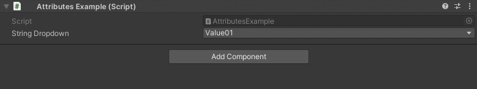

Dropdown Attribute
==================

Attribute to make a dropdown menu out of a collection of elements.

**Parameters:**
	- ``string`` collectionName: The name of the array or list

Example::

	using UnityEngine;
	using EditorAttributes;
	
	public class AttributesExample : MonoBehaviour
	{
		[SerializeField, Dropdown(nameof(dropdownValue))] private string stringDropdown;
	
		private string[] dropdownValue = new string[]
		{
			"Value01", "Value02", "Value03"
		};
	}

Now you can specify the value of the ``string`` from a dropdown.

