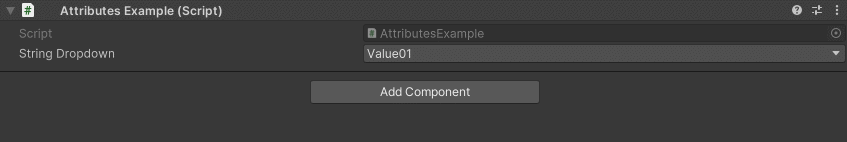
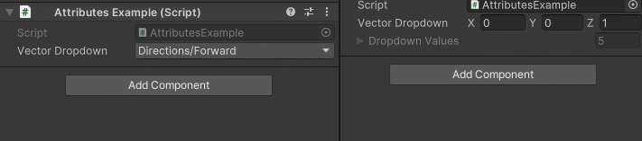

Dropdown Attribute
==================

Attribute to make a dropdown menu out of a collection of elements.

**Parameters:**
	- ``string`` valueCollectionName: The name of the collection for the values set by the dropdown
	- ``string[]`` displayNames: Change the display name for each item inside the dropdown

Example::

	using UnityEngine;
	using EditorAttributes;
	
	public class AttributesExample : MonoBehaviour
	{
		[SerializeField, Dropdown(nameof(dropdownValues))] private string stringDropdown;
	
		private string[] dropdownValues = new string[]
		{
			"Value01", "Value02", "Value03"
		};
	}

Now you can specify the value of the ``string`` from a dropdown.

You can also customize how to display dropdown values by passing a ``string`` array like this::

	using UnityEngine;
	using EditorAttributes;
	
	public class AttributesExample : MonoBehaviour
	{
		[Dropdown(nameof(dropdownValues), new string[] { "Directions/Forward", "Directions/Up", "Directions/Down", "One", "Zero" })] 
		[SerializeField] private Vector3 vectorDropdown;
	
		private Vector3[] dropdownValues = new Vector3[]
		{
			Vector3.forward, Vector3.up, Vector3.down, Vector3.one, Vector3.zero
		};
	}

Or alternatively use a Dictionary where the keys will be used for display::

	using UnityEngine;
	using EditorAttributes;
	using System.Collections.Generic;
	
	public class AttributesExample : MonoBehaviour
	{
		[Dropdown(nameof(dropdownValues))] 
		[SerializeField] private Vector3 vectorDropdown;
	
		private Dictionary<string, Vector3> dropdownValues = new()
		{
			{ "Directions/Forward", Vector3.forward },
			{ "Directions/Up", Vector3.up }, 
			{ "Directions/Down", Vector3.down }, 
			{ "One", Vector3.one }, 
			{ "Zero", Vector3.zero }
		};
	}
	

.. note:: 
	If you try to use both a Dictionary and a ``string`` array with the attribute, the array will take priority for the displayed values.