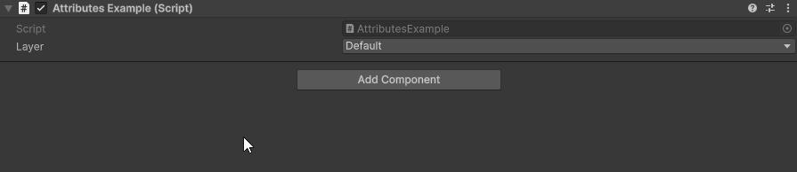

LayerDropdown Attribute
=======================

Attribute to make a single selection dropdown of layers

.. note::
	The `LayerDropdown Attribute` can only be attached to a ``string``

Example::

	using UnityEngine;
	using EditorAttributes;
	
	public class AttributesExample : MonoBehaviour
	{
		[SerializeField, LayerDropdown] private string layer;
	}

