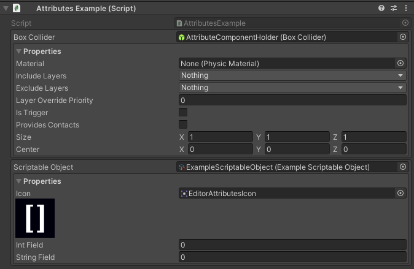

PropertyDropdown Attribute
==========================

Attribute to make a dropdown containing all properties of a ``Component`` or ``ScriptableObject``.

.. note::
	The `PropertyDropdown Attribute` can only be attached to a field deriving from ``Component`` or ``ScriptableObject``

Example::

	using UnityEngine;
	using EditorAttributes;
	
	public class AttributesExample : MonoBehaviour
	{
		[SerializeField, PropertyDropdown] private BoxCollider boxCollider;
		[SerializeField, PropertyDropdown] private ExampleScriptableObject scriptableObject;
	}

.. note::
	The `PropertyDropdown Attribute` is not able to apply custom editor modifications when drawing properties only property drawers
