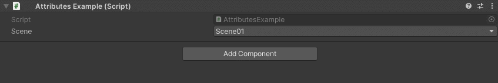

SceneDropdown Attribute
=======================

Attribute to make a dropdown containing all scenes in the build settings

If the attribute is attached to a ``string`` it will get the scene name, if is attached to an ``int`` it will get the scene index::

	using UnityEngine;
	using EditorAttributes;
	
	public class AttributesExample : MonoBehaviour
	{
		[SerializeField, SceneDropdown] private string scene;
	}

