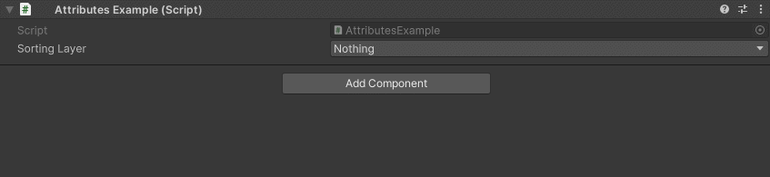

SortingLayerDropdown Attribute
==============================

Attribute to make a dropdown of sorting layers

.. note::
	The `SortingLayerDropdown Attribute` can only be attached to an ``int``

Example::

	using UnityEngine;
	using EditorAttributes;
	
	public class AttributesExample : MonoBehaviour
	{
		[SerializeField, SortingLayerDropdown] private int sortingLayer;
	}

