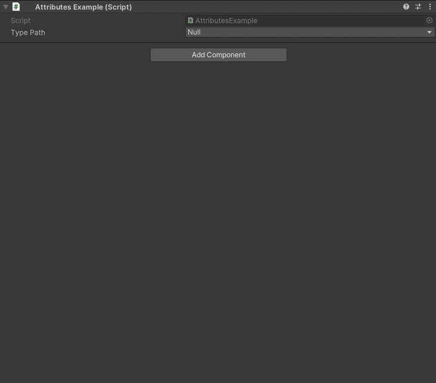

TypeDropdown Attribute
======================

Attribute to make a dropdown of type paths

**Parameters:**
	- `optional`, ``string`` assemblyName: Filter which types are displayed by the assembly name

.. note::
	The `TypeDropdown Attribute` can only be attached to a ``string``

The dropdown will return a string that can be used with the `Type.GetType() <https://learn.microsoft.com/en-us/dotnet/api/system.type.gettype>`_ function::

	using UnityEngine;
	using EditorAttributes;
	
	public class AttributesExample : MonoBehaviour
	{
		[SerializeField, TypeDropdown] private string typePath;
	}

By default the dropdown will display all visible types in the project, but you can also filter which types you display by the assembly name which will also show internal and private types::

	using UnityEngine;
	using EditorAttributes;
	
	public class AttributesExample : MonoBehaviour
	{
		[SerializeField, TypeDropdown("UnityEngine.CoreModule")] private string typePath;
	}

