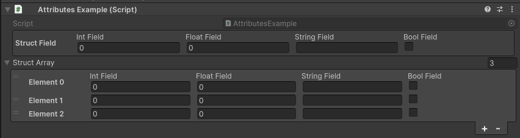

DataTable Attribute
===================

Attribute to draw the members of a serialized struct or class in a table instead of a dropdown

Example::

	using System;
	using UnityEngine;
	using EditorAttributes;
	
	public class AttributesExample : MonoBehaviour
	{
		[Serializable]
		private struct Data
		{
			public int intField;
			public float floatField;
			public string stringField;
			public bool boolField;
		}
	
		[SerializeField, DataTable] private Data structField;
		[SerializeField, DataTable] private Data[] structArray;
	}

.. note:: 
	The data table can't contain collections, UnityEvents or other serialized structs or classes
