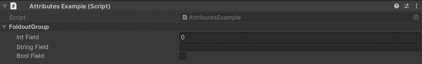

FoldoutGroup Attribute
======================

Attribute to display the specified fields in a foldout

**Parameters:**
	- ``string`` groupName: The name of the group
	- `optional`, ``float`` labelWidth: The width of the field labels
	- `optional`, ``float`` fieldWidth: The width of the input fields
	- `optional`, ``bool`` drawInBox: Draw the group in a nice box
	- `params`, ``string`` fieldsToGroup: The name of the fields to group

Example::

	using UnityEngine;
	using EditorAttributes;
	
	public class AttributesExample : MonoBehaviour
	{
		[FoldoutGroup("FoldoutGroup", nameof(intField), nameof(stringField), nameof(boolField))]
		[SerializeField] private Void groupHolder;
	
		[SerializeField, HideInInspector] private int intField;
		[SerializeField, HideInInspector] private string stringField;
		[SerializeField, HideInInspector] private bool boolField;
	}
	

