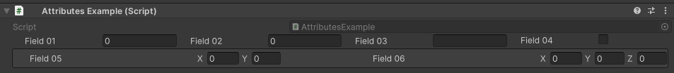

HorizontalGroup Attribute
=========================

Attribute to display specified fields horizontally.

**Parameters:**
	- `optional`, ``float`` widthOffset: By how much to offset the width of the properties in pixels
	- `optional`, ``float`` propertySpace: How much space in pixels is between the properties
	- `optional`, ``bool`` drawInBox: Draw the group in a nice box
	- `params`, ``string`` fieldsToGroup: The name of the fields to group

Example::
	
	using UnityEngine;
	using EditorAttributes;
	
	public class AttributesExample : MonoBehaviour
	{
		[SerializeField, HorizontalGroup(nameof(field01), nameof(field02), nameof(field03), nameof(field04))]
		private Void groupHolder01;
	
		[SerializeField, HorizontalGroup(50f, 50f, true, nameof(field05), nameof(field06))]
		private Void groupHolder02;
	
		[SerializeField, HideProperty] private int field01;
		[SerializeField, HideProperty] private float field02;
		[SerializeField, HideProperty] private string field03;
		[SerializeField, HideProperty] private bool field04;
	
		[SerializeField, HideProperty] private Vector2 field05;
		[SerializeField, HideProperty] private Vector3 field06;
	}

