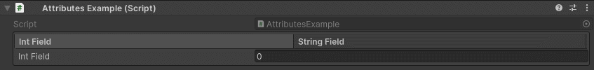
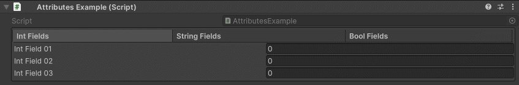

TabGroup Attribute
==================

Attribute to display specified fields in a tabbed group.

**Parameters:**
	- `params`, ``string`` fieldsToGroup: The name of the fields to group

The name of the field will be used as the tab label::

	using UnityEngine;
	using EditorAttributes;
	
	public class AttributesExample : MonoBehaviour
	{
		[TabGroup(nameof(intField), nameof(stringField))]
		[SerializeField] private Void groupHolder;
	
		[SerializeField, HideProperty] private int intField;
		[SerializeField, HideProperty] private string stringField;
	}

If you want to display multiple fields in one tab put those fields inside a group first then put those groups as the parameters of the tab group::

	using UnityEngine;
	using EditorAttributes;
	
	public class AttributesExample : MonoBehaviour
	{
		[TabGroup(nameof(intFields), nameof(stringFields), nameof(boolFields))]
		[SerializeField] private Void groupHolder;
	
		[VerticalGroup(nameof(intField01), nameof(intField02), nameof(intField03))]
		[SerializeField, HideInInspector] private Void intFields;
	
		[VerticalGroup(nameof(stringField01), nameof(stringField02), nameof(stringField03))]
		[SerializeField, HideInInspector] private Void stringFields;
	
		[VerticalGroup(drawInBox: true, nameof(boolField01), nameof(boolField02), nameof(boolField03))]
		[SerializeField, HideInInspector] private Void boolFields;
	
		[SerializeField, HideProperty] private int intField01;
		[SerializeField, HideProperty] private int intField02;
		[SerializeField, HideProperty] private int intField03;
	
		[SerializeField, HideProperty] private string stringField01;
		[SerializeField, HideProperty] private string stringField02;
		[SerializeField, HideProperty] private string stringField03;
	
		[SerializeField, HideProperty] private bool boolField01;
		[SerializeField, HideProperty] private bool boolField02;
		[SerializeField, HideProperty] private bool boolField03;
	}

