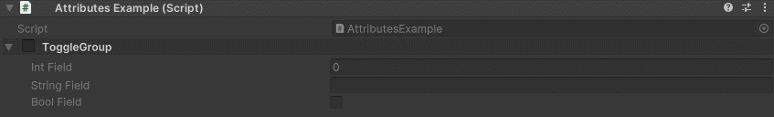
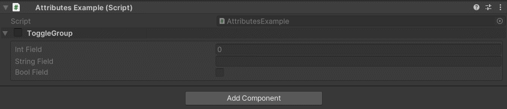

ToggleGroup Attribute
=====================

Attribute to display the specified fields in a toggleble group

**Parameters:**
	- ``string`` groupName: The name of the group
	- `optional`, ``bool`` drawInBox: Draw the group in a nice box
	- `params`, ``string`` fieldsToGroup: The name of the fields to group

Example::

	using UnityEngine;
	using EditorAttributes;
	
	public class AttributesExample : MonoBehaviour
	{
		[ToggleGroup("ToggleGroup", nameof(intField), nameof(stringField), nameof(boolField))]
		[SerializeField] private Void groupHolder;
	
		[SerializeField, HideProperty] private int intField;
		[SerializeField, HideProperty] private string stringField;
		[SerializeField, HideProperty] private bool boolField;
	}
	

If you place the `ToggleGroup Attribute` on a ``bool`` the toggle value it will be set to that bool::

	using UnityEngine;
	using EditorAttributes;
	
	public class AttributesExample : MonoBehaviour
	{
		[ToggleGroup("ToggleGroup", drawInBox: true, nameof(intField), nameof(stringField), nameof(boolField))]
		[SerializeField] private bool toggleGroup;
	
		[MessageBox("The group is toggled", nameof(toggleGroup))]
		[SerializeField, HideProperty] private int intField;
		[SerializeField, HideProperty] private string stringField;
		[SerializeField, HideProperty] private bool boolField;
	}
	

