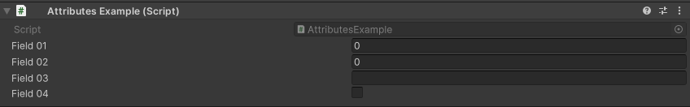

VerticalGroup Attribute
=======================

Attribute to display the specified fields vertically.

**Parameters:**
	- `optional`, ``float`` widthOffset: By how much to offset the width of the properties in pixels
	- `optional`, ``bool`` drawInBox: Draw the group in a nice box
	- `params`, ``string`` fieldsToGroup: The name of the fields to group

Example::

	using UnityEngine;
	using EditorAttributes;
	
	public class AttributesExample : MonoBehaviour
	{
		[SerializeField, VerticalGroup(nameof(field01), nameof(field02), nameof(field03), nameof(field04))]
		private Void groupHolder;
	
		// The fields needs to be serialized, but we don't want them to show twice in the inspector
		[SerializeField, HideProperty] private int field01;
		[SerializeField, HideProperty] private float field02;
		[SerializeField, HideProperty] private string field03;
		[SerializeField, HideProperty] private bool field04;
	}

This attribute is best used with the :doc:`horizontalgroup` to display a bunch of field groups horizontally::

	using UnityEngine;
	using EditorAttributes;
	
	public class AttributesExample : MonoBehaviour
	{
		[HorizontalGroup(nameof(verticalGroupHolder01), nameof(verticalGroupHolder02))]
		[SerializeField] private Void horizontalGroupHolder;
	
		[VerticalGroup(drawInBox: true, nameof(intField01), nameof(stringField01), nameof(boolField01))]
		[SerializeField, HideInInspector] private Void verticalGroupHolder01;
	
		[VerticalGroup(drawInBox: true, nameof(intField02), nameof(stringField02), nameof(boolField02))]
		[SerializeField, HideInInspector] private Void verticalGroupHolder02;
	
		[SerializeField, HideProperty] private int intField01;
		[SerializeField, HideProperty] private string stringField01;
		[SerializeField, HideProperty] private bool boolField01;
	
		[SerializeField, HideProperty] private int intField02;
		[SerializeField, HideProperty] private string stringField02;
		[SerializeField, HideProperty] private bool boolField02;
	}

.. image:: ../../Images/VerticalGroup02.png
