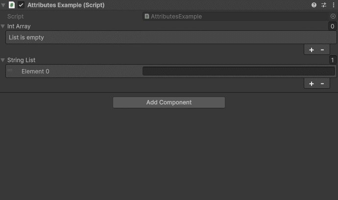

CollectionRange Attribute
=========================

.. note::
	This attribute is only available in *Unity 6 and above*.

Attribute to limit the size of a collection between a range.
	
Example::

	using UnityEngine;
	using EditorAttributes;
	
	public class AttributesExample : MonoBehaviour
	{
		[CollectionRange(0, 5)]
		[SerializeField] private int[] intArray;
	
		[CollectionRange(1, 7)]
		[SerializeField] private List<string> stringList;
	}

