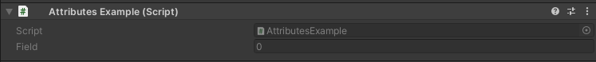
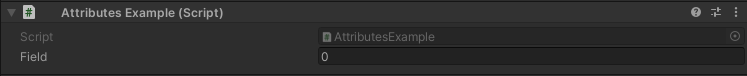

DisableInEditMode Attribute
===========================

Attribute to disable a field when outside of play mode::

	using UnityEngine;
	using EditorAttributes;
	
	public class AttributesExample : MonoBehaviour
	{
		[SerializeField, DisableInEditMode] private int field;
	}

Outside of play mode:

During play mode:

Useful when you want to enable certain fields only when playing.
