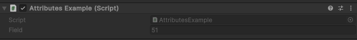

DisableInPlayMode Attribute
===========================

Attribute to disable a field when entering play mode::

	using UnityEngine;
	using EditorAttributes;
	
	public class AttributesExample : MonoBehaviour
	{
		[SerializeField, DisableInPlayMode] private int field = "51";
	}

Outside of play mode:

.. image:: ../../Images/DisableInPlaymode01.png

During play mode:

Useful when you want to make sure no values can be modified in the inspector while you're playing the game but you can still see them.
