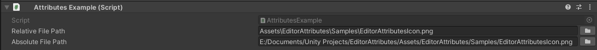

FilePath Attribute
==================

Attribute to get the path of a file.

**Parameters:**
	- `optional`, ``bool`` filters: Get the relative path of the file
	- `optional`, ``string`` fileExtension: Filters the files by the specified extension

.. note::
	The `FilePath Attribute` can only be attached to a ``string``

Example::

	using UnityEngine;
	using EditorAttributes;
	
	public class AttributesExample : MonoBehaviour
	{
		[SerializeField, FilePath] private string relativeFilePath;
		[SerializeField, FilePath(false)] private string absoluteFilePath;
	}

You can filter file types by typing the file extenstions in the `filters` parameter::

	using UnityEngine;
	using EditorAttributes;
	
	public class AttributesExample : MonoBehaviour
	{
		[SerializeField, FilePath(filters: "cs")] private string fileFilter; // Will only find C# files
	
		// Make sure you don't include any spaces when passing multiple file extensions
		[SerializeField, FilePath(filters: "cs,unity")] private string multipleFileFilters; // Will only find C# and Unity Scene files
	}

