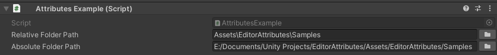

FolderPath Attribute
====================

Attribute to get the path of a folder.

**Parameters:**
	- `optional`, ``bool`` getRelativePath: Get the relative path of the folder

.. note::
	The `FolderPath Attribute` can only be attached to a ``string``

Example::

	using UnityEngine;
	using EditorAttributes;
	
	public class AttributesExample : MonoBehaviour
	{
		[SerializeField, FolderPath] private string relativeFolderPath;
		[SerializeField, FolderPath(false)] private string absoluteFolderPath;
	}

