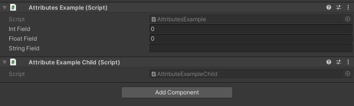

HideInChildren Attribute
========================

Attribute to hide the inherited field in the child classes

Example::

	using UnityEngine;
	using EditorAttributes;
	
	public class AttributesExample : MonoBehaviour
	{
		[SerializeField, HideInChildren] private int intField;
		[SerializeField, HideInChildren] private float floatField;
		[SerializeField, HideInChildren] private string stringField;
	}

	// In a separate file
	public class AttributeExampleChild : AttributesExample
	{	
	
	}

