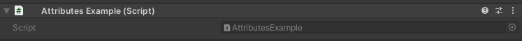

HideInEditMode Attribute
========================

Attribute to hide a field when outside of play mode::

	using UnityEngine;
	using EditorAttributes;
	
	public class AttributesExample : MonoBehaviour
	{
		[SerializeField, HideInEditMode] private int field;
	}

Outside of play mode:

During play mode:

.. image:: ../../Images/HideInEditmode02.png

Useful when you want to show certain fields only when playing.
