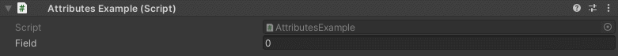

HideInPlayMode Attribute
=======================

Attribute to hide a field when entering play mode::
	
	using UnityEngine;
	using EditorAttributes;
	
	public class AttributesExample : MonoBehaviour
	{
		[SerializeField, HideInPlayMode] private int field;
	}

