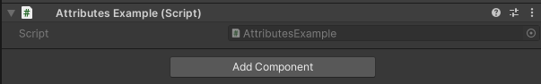

HideProperty Attribute
======================

Attribute to hide a field in the inspector but still show it in debug view.
	
Example::

	using UnityEngine;
	using EditorAttributes;
	
	public class AttributesExample : MonoBehaviour
	{
		[HideProperty] public int field;
	}

Normal inspector mode:

Debug inspector mode:

.. image:: ../../Images/HideProperty02.png

The intended usage for this attribute is for fields grouped by the :doc:`..\..\GroupingAttributes\index`, since you need to hide the original fields else they will be shown twice, hiding them with the
`HideInInspector Attribute <https://docs.unity3d.com/ScriptReference/HideInInspector.html>`_ works well but this will also hide them in Debug View which might not be ideal.
Another usage is to hide members that you don't want displayed when the `Show Static Members` or `Show Non Serialized Members` option is enabled.

.. note::
	The attribute wont work inside serialized structs or classes.
	
.. note::
	If the attribute is attached to an inherited field, that field has to be marked as ``public`` or ``protected`` for it to work.
