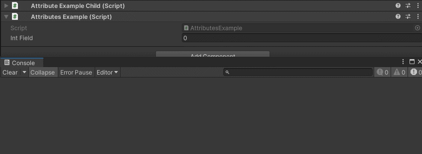

OnValueChanged Attribute
========================

Attribute to call a function when the value of the attached property changes

**Parameters:**
	- ``string`` name: The name of the function to call

Example::

	using UnityEngine;
	using EditorAttributes;
	
	public class AttributesExample : MonoBehaviour
	{
		[SerializeField, OnValueChanged(nameof(PrintInt))] private int intField;
	
		private void PrintInt() => print(intField);
	}

