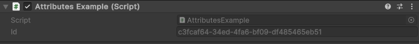

ReadOnly Attribute
==================

Attribute to make a field readonly in the inspector

Example::

	using UnityEngine;
	using EditorAttributes;
	
	public class AttributesExample : MonoBehaviour
	{
		[SerializeField, ReadOnly] private string id = "c3fcaf64-34ed-4fa6-bf09-df485465eb51";
	}

Useful when you want to display information in the inspector but you don’t want it to be accidentally edited.
